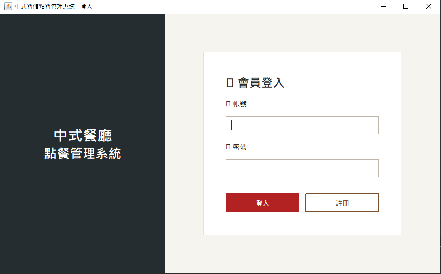
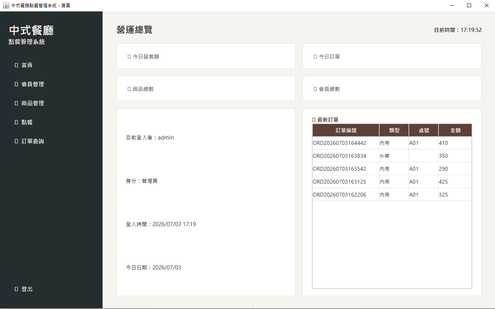
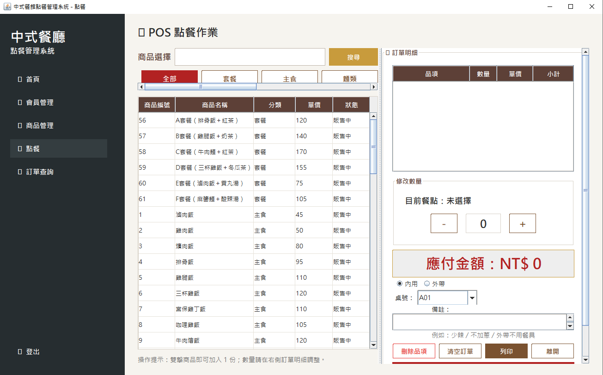
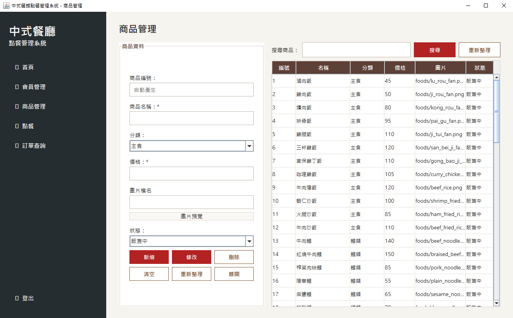
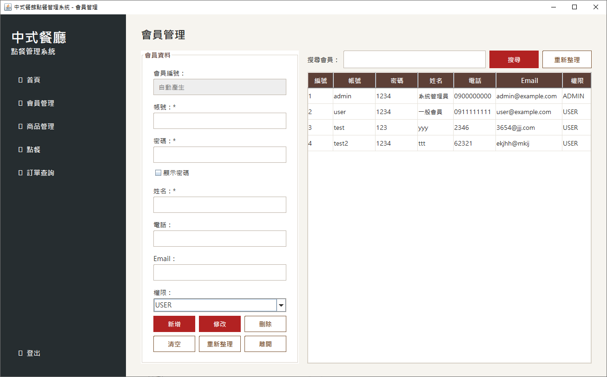
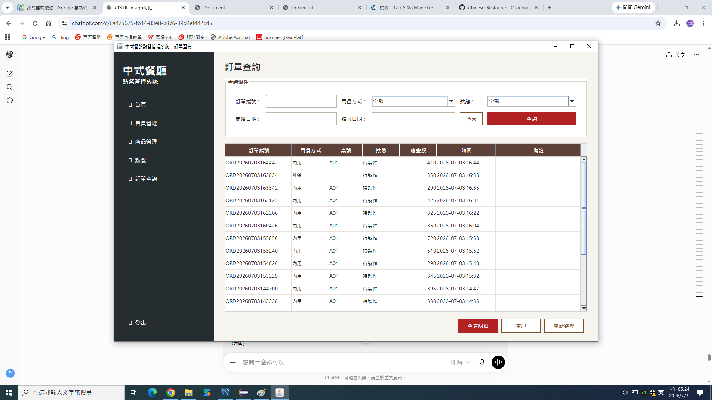
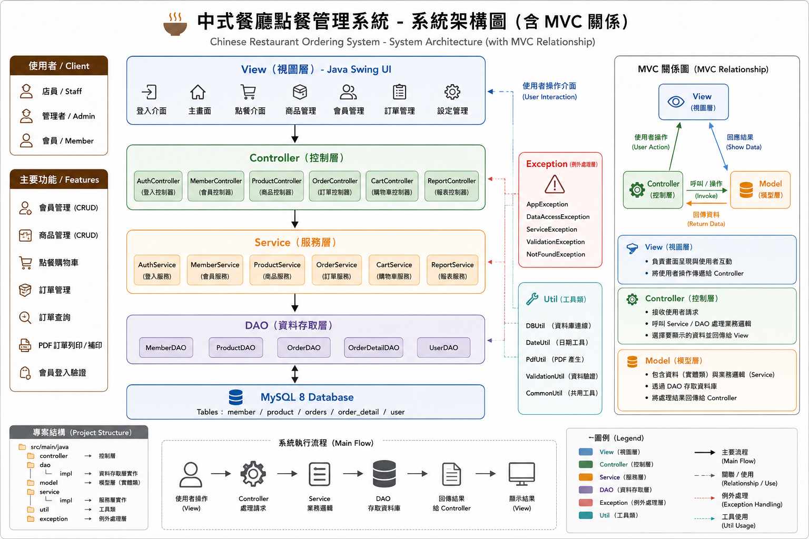
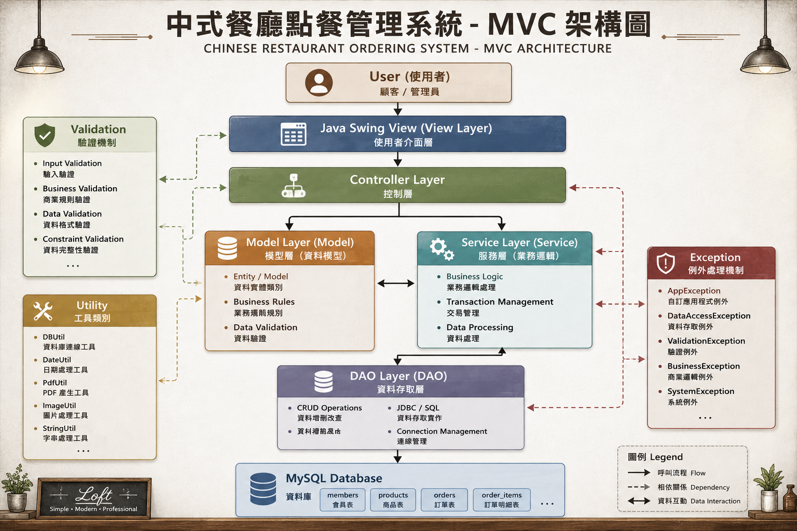
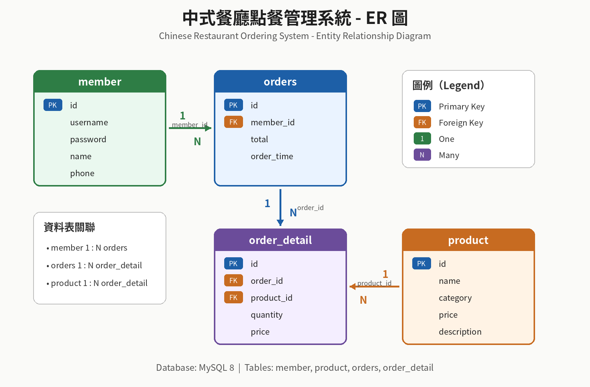
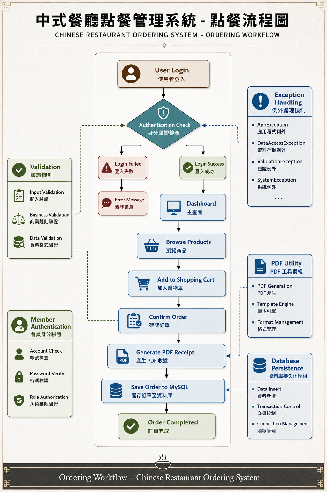

# 🍽 中式餐廳點餐管理系統
### Chinese Restaurant Ordering System


---

## 📖 專案介紹

本專案為一套以 **Java Swing** 開發的中式餐廳點餐管理系統，採用 **MVC（Model-View-Controller）** 與 **DAO Pattern** 分層架構設計。

系統整合會員管理、商品管理、點餐購物車、訂單管理及 PDF 訂單列印等功能，並使用 **Maven** 管理專案、**MySQL 8** 作為資料庫。

此外，本專案導入 **CIS（Corporate Identity System）** 設計理念，以 Loft 輕工業風格打造一致且易於操作的桌面使用者介面，展現 Java Desktop Application、MVC 架構設計、資料庫整合及桌面應用程式開發能力。

---

## 🏆 專案亮點

- ☕ Java 11
- 🖥 Java Swing
- 🏗 MVC Architecture
- 📂 DAO Pattern
- 📦 Maven
- 🗄 MySQL 8
- 🔗 JDBC
- 👤 會員管理（CRUD）
- 🍽 商品管理（CRUD）
- 🛒 點餐購物車
- 📄 訂單管理
- 🖨 PDF 訂單列印
- 🎨 CIS UI Design

---

## 📸 系統畫面（System Preview）

| 登入 | 主畫面 | 點餐 |
|------|--------|------|
|  |  |  |

| 商品管理 | 會員管理 | 訂單管理 |
|-----------|-----------|-----------|
|  |  |  |

## ✨ 系統功能（Features）

- 👤 會員管理（新增、查詢、修改、刪除）
- 🍽 商品管理（新增、查詢、修改、刪除）
- 🛒 點餐購物車
- 📄 訂單管理
- 🖨 PDF 訂單列印／補印
- 🔍 訂單查詢
- 🔐 會員登入驗證
- 💾 MySQL 資料持久化

---

## 💻 技術架構（Technology Stack）

| 類別 | 技術 |
|------|------|
| 程式語言 | Java 11 |
| 使用者介面 | Java Swing |
| 開發工具 | Eclipse WindowBuilder |
| 建置工具 | Maven |
| 資料庫 | MySQL 8 |
| 架構設計 | MVC + DAO Pattern |
| 資料存取 | JDBC |
| PDF | OpenPDF |
| 版本控制 | Git / GitHub |


## 🏗 System Architecture



---

## 🧩 MVC Architecture



---

## 🗄 資料庫設計（Database Design）

本系統使用 **MySQL 8** 作為資料庫，採用關聯式資料庫設計，共包含四個主要資料表：

- 👤 `member`：會員資料
- 🍽 `product`：商品資料
- 📄 `orders`：訂單資料
- 📋 `order_detail`：訂單明細

### Entity Relationship Diagram（ER Diagram）

此 ER Diagram 展示會員、商品、訂單與訂單明細之間的關聯設計，作為本系統資料庫模型的核心。


---

## 🔄 Ordering Workflow

以下流程展示使用者從登入、商品瀏覽、加入購物車、確認訂單、產生 PDF 收據到寫入 MySQL 資料庫的完整流程。



---

## 📁 專案目錄（Project Structure）

本專案採用 Maven 標準目錄結構，並依 MVC + DAO Pattern 進行模組化設計。

```text
src/main/java
├── controller
├── dao
│   └── impl
├── service
│   └── impl
├── model
├── util
└── exception
```

---

## ⚙️ 開發環境（Development Environment）

| 項目 | 版本 |
|------|------|
| JDK | Java 11 |
| IDE | Eclipse IDE + WindowBuilder |
| Build Tool | Maven |
| Database | MySQL 8 |
| OS | Windows 10 / Windows 11 |

---


## 🚀 安裝與執行（Getting Started）

### 1️⃣ 下載專案

```bash
git clone https://github.com/William-Kuo19/Chinese-Restaurant-Ordering-System.git
```

或直接下載本專案 ZIP 檔並解壓縮。

---

### 2️⃣ 匯入 Eclipse

- 開啟 Eclipse IDE
- 選擇 **File → Import**
- 選擇 **Existing Maven Projects**
- 匯入 `Chinese-Restaurant-Ordering-System`

---

### 3️⃣ 建立 MySQL 資料庫

1. 建立 MySQL 8 資料庫
2. 執行 SQL 腳本：

```text
sql/restaurant.sql
```

---

### 4️⃣ 設定資料庫連線

修改資料庫連線設定，例如：

- 資料庫名稱
- 使用者帳號
- 密碼

請依照自己的 MySQL 環境修改 `DBUtil.java`（或你的資料庫連線設定檔）。

---

### 5️⃣ 執行系統

在 Eclipse 執行：

```text
LoginUI.java
```

即可開始使用系統。


---

## 📚 專案文件（Documentation）

更多詳細設計文件請參閱下列文件：

- 📄 DATABASE.md
  - MySQL 資料庫設計與說明

- 📄 PROJECT_STRUCTURE.md
  - 專案架構與資料夾說明

---

## 📄 授權（License）

本專案採用 MIT License。